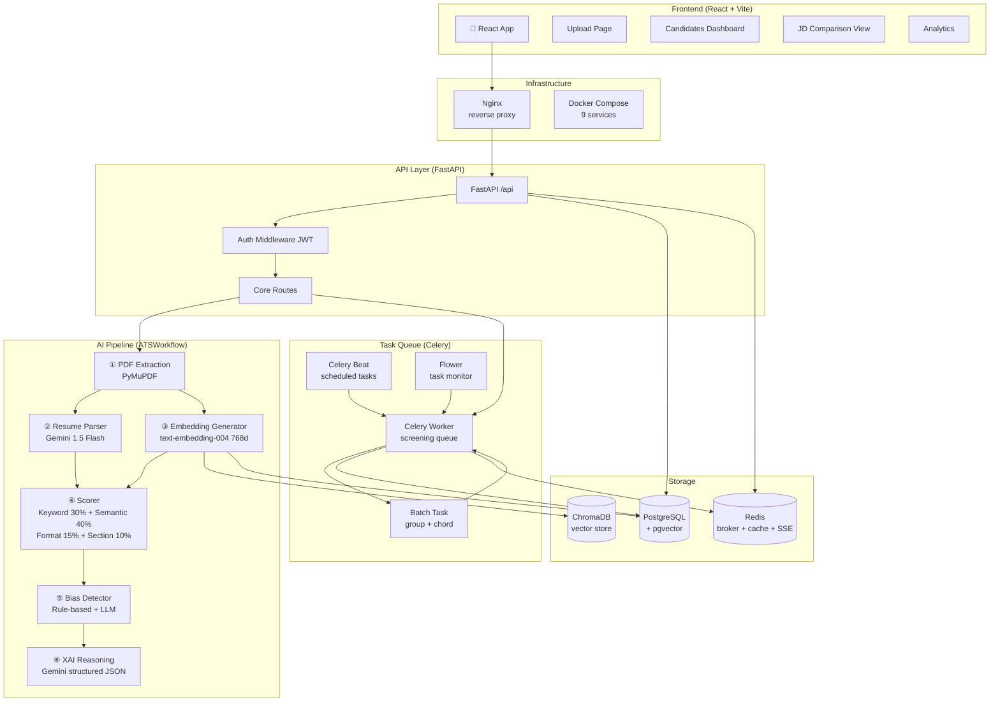
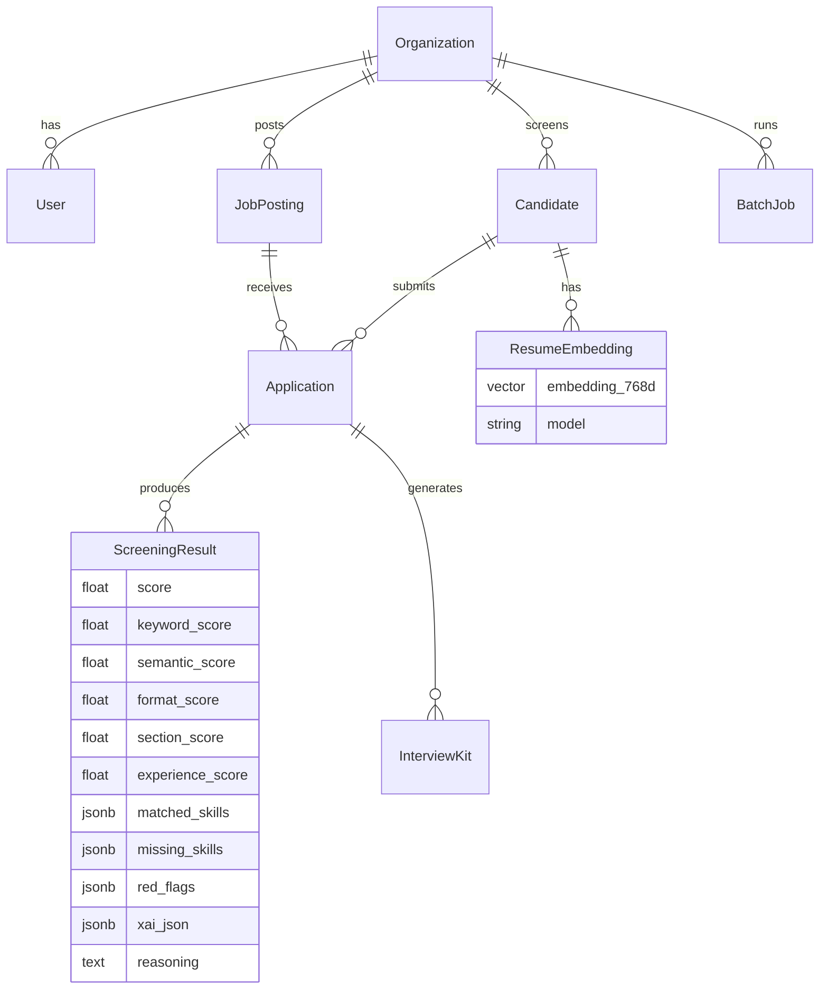
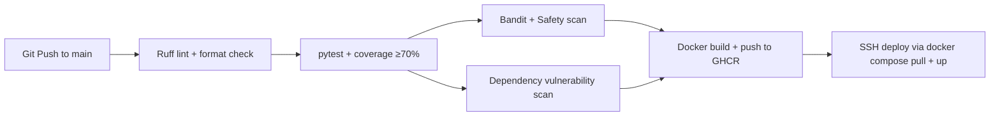

# Architecture — AI Resume Screening System

## System Overview

This is a **portfolio-grade AI-powered ATS (Applicant Tracking System)** built as a full-stack
microservices application. The system uses a multi-stage AI pipeline to screen resumes against
job descriptions with explainable AI reasoning.

---

## System Architecture Diagram



---

## Component Deep-Dive

### AI Pipeline (6 Stages)

The pipeline runs agents **in parallel** using `asyncio.gather` where safe:

| Stage | Component | Technology | Description |
|-------|-----------|-----------|-------------|
| ① | PDF Extractor | PyMuPDF | Text extraction from PDF/text files |
| ② | Resume Parser | Gemini 1.5 Flash | Structured JSON extraction (name, skills, experience, education, projects) |
| ③ | Embedding | Gemini text-embedding-004 (768d) | Semantic vector generation for cosine similarity |
| ④ | Scorer | `core/scorer.py` | Hybrid score: Keyword(30%) + Semantic(40%) + Format(15%) + Section(10%) |
| ⑤ | Bias Detector | Rule-based + LLM | Gender/age/prestige bias analysis on JD |
| ⑥ | XAI Reasoning | Gemini 1.5 Flash | Structured verdict + per-dimension reasoning + red flags |

### Scoring Formula

```
Overall Score = 
  (keyword_score × 0.30) +
  (semantic_score × 0.40) +
  (format_score  × 0.15) +
  (section_score × 0.10) +
  (experience_score penalty if below threshold)
```

- **Keyword Score**: rapidfuzz fuzzy matching + skill taxonomy synonyms (`skill_synonyms.py`)
- **Semantic Score**: cosine similarity between candidate embedding and JD embedding (768-dim)
- **Format Score**: length heuristics, section headers, contact info completeness
- **Section Score**: presence of Education, Experience, Skills, Projects, Certifications
- **Verdicts**: ACCEPT (≥70), REVIEW (40-69), REJECT (<40)

### Database Schema



### Celery Task Architecture

```
POST /resume/upload  →  ATSWorkflow.process() [synchronous, returns immediately]
POST /bulk-upload    →  BatchJob created → process_batch.delay()
                           └→ Celery group [screen_resume × N files]
                                └→ chord callback: batch_complete_callback
                                     └→ BatchJob.status = COMPLETED
```

**Progress Tracking:** Each `screen_resume` task writes progress to Redis `task_status:{task_id}`:
```
5%  → Fetching application data
15% → Checking cache
30% → Parsing resume
45% → Generating embeddings
80% → Saving results
100% → Screening complete
```

Frontend polls `GET /api/tasks/{task_id}/status` every 2s with Redis-first lookup.

### Caching Strategy

| Level | Key | TTL | Description |
|-------|-----|-----|-------------|
| L1 | In-memory LRU | Process lifetime | Hot embeddings cache |
| L2 | Redis | 24h | JD-resume pair results (SHA256 hash key) |
| L3 | PostgreSQL + pgvector | Persistent | Stored embeddings for semantic search |

Cache key: `scoring_result:{sha256(jd_text[:500] + resume_text[:1000])[:24]}`

### LLM Resilience

All Gemini API calls use **tenacity** retry with:
- `stop_after_attempt(4)` — maximum 4 retries
- `wait_exponential(min=1, max=60)` — 1s → 2s → 4s → 8s backoff
- Retries on: `429 rate limit`, `503 service unavailable`, `500 server error`, network timeouts
- Celery task retry: exponential `60s → 120s → 240s` on unrecoverable errors

---

## API Reference

### Core Endpoints

| Method | Path | Auth | Description |
|--------|------|------|-------------|
| POST | `/api/resume/upload` | Recruiter | Upload PDF + screen synchronously |
| POST | `/api/bulk-upload` | Recruiter | Upload ZIP with multiple PDFs (async) |
| GET | `/api/candidates` | Viewer | Paginated candidate list with scores |
| GET | `/api/candidates/{id}/score` | Viewer | Full 5-component score breakdown |
| GET | `/api/tasks/{task_id}/status` | Viewer | Poll Celery task progress |
| GET | `/api/batch/{batch_id}/status` | Viewer | Poll batch job progress |
| GET | `/api/jobs` | Viewer | Paginated job postings |
| POST | `/api/jobs` | Recruiter | Create job posting |
| POST | `/api/jobs/{id}/match-candidates` | Recruiter | Rank all candidates for a job |
| GET | `/api/metrics` | Viewer | Accept/Review/Reject counts + avg score |
| GET | `/api/bias-report?job_id=N` | Viewer | JD bias analysis report |
| POST | `/api/chat` | Viewer | Semantic candidate search (RAG) |

### Pagination Parameters

All list endpoints support:
```
GET /api/candidates?page=1&page_size=20&sort_by=score&sort_order=desc&min_score=60&job_id=5
GET /api/jobs?page=1&page_size=20&status=active
```

---

## Quickstart (Local Dev)

### Prerequisites
- Docker + Docker Compose
- A Google Gemini API key (`GOOGLE_API_KEY`)

### One-Command Boot

```bash
# 1. Clone and configure
git clone https://github.com/Vedanth-JS/AI-Resume-Screening-System
cd AI-Resume-Screening-System
cp backend/.env.template backend/.env
# Edit backend/.env and set GOOGLE_API_KEY, POSTGRES_PASSWORD, etc.

# 2. Start all 9 services
docker compose up -d

# 3. Run database migrations
docker compose exec api alembic upgrade head

# 4. Open the app
open http://localhost:3000   # Frontend
open http://localhost:8000/docs  # FastAPI Swagger UI
open http://localhost:5555   # Flower (Celery dashboard)
```

### Key Services

| Service | Port | Description |
|---------|------|-------------|
| Frontend (Nginx) | 3000 | React SPA |
| FastAPI API | 8000 | Main API |
| FastAPI API 2 | 8001 | Load-balanced replica |
| Celery Worker | — | Background task runner |
| Celery Beat | — | Scheduled task scheduler |
| Flower | 5555 | Celery task monitor |
| PostgreSQL | 5432 | Primary database |
| Redis | 6379 | Message broker + cache |
| ChromaDB | 8080 | Vector store |

### API Test (curl)

```bash
# Login
TOKEN=$(curl -s -X POST http://localhost:8000/api/auth/login \
  -H "Content-Type: application/json" \
  -d '{"email":"admin@example.com","password":"admin123"}' | jq -r '.access_token')

# Upload a resume
curl -X POST http://localhost:8000/api/resume/upload \
  -H "Authorization: Bearer $TOKEN" \
  -F "file=@resume.pdf" \
  -F "job_id=1"

# Get paginated candidates sorted by score
curl "http://localhost:8000/api/candidates?sort_by=score&sort_order=desc&min_score=60" \
  -H "Authorization: Bearer $TOKEN"

# Get full score breakdown for candidate #42
curl http://localhost:8000/api/candidates/42/score \
  -H "Authorization: Bearer $TOKEN"
```

---

## CI/CD Pipeline



---

## Tech Stack Summary

| Layer | Technology |
|-------|-----------|
| **Backend** | FastAPI, Python 3.11, Pydantic v2 |
| **Database** | PostgreSQL 16 + pgvector extension |
| **ORM** | SQLAlchemy 2.0 async + Alembic migrations |
| **Task Queue** | Celery 5 + Redis |
| **AI/LLM** | Google Gemini 1.5 Flash + text-embedding-004 |
| **NLP** | rapidfuzz, spaCy, sentence-transformers |
| **Vector Store** | pgvector (PostgreSQL) + ChromaDB |
| **Frontend** | React 18 + TypeScript + Vite |
| **Charts** | Recharts (RadarChart, BarChart) |
| **Resilience** | tenacity (exponential backoff) |
| **Auth** | JWT (PyJWT) + bcrypt + TOTP (2FA) |
| **Observability** | structlog, Prometheus, Flower |
| **Infrastructure** | Docker Compose (9 services), Nginx |
| **CI/CD** | GitHub Actions (lint → test → security → Docker → deploy) |
