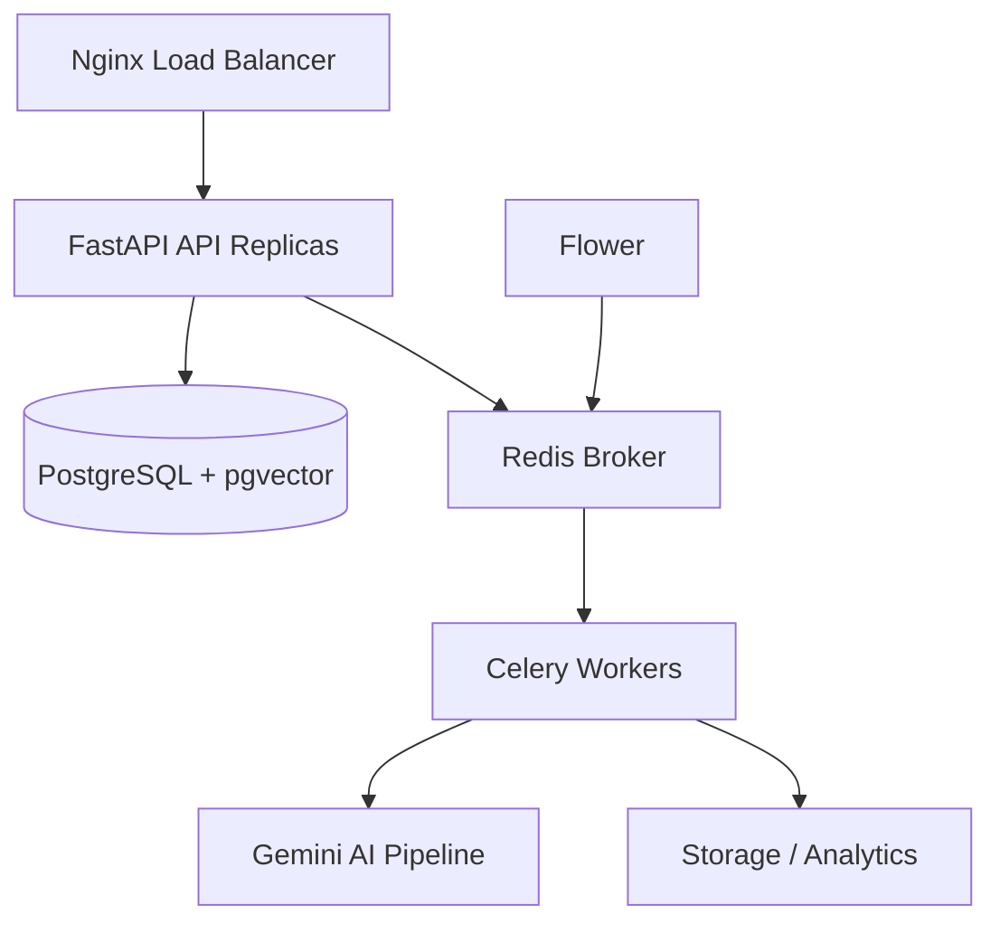

<div align="center">
  
  <h1>Antigravity AI ATS</h1>
  <p><strong>Enterprise-Grade Applicant Tracking System powered by Google Gemini & LangGraph</strong></p>

  [](https://github.com/vedanth-js/ai-ats/actions)
  [](https://www.python.org/downloads/release/python-3110/)
  [](https://opensource.org/licenses/MIT)
  [](https://www.docker.com/)
  <br />
  <a href="#-quick-start">Quick Start</a> •
  <a href="#-architecture">Architecture</a> •
  <a href="#-features">Features</a> •
  <a href="ARCHITECTURE.md">System Design</a>
</div>

---

## 🚀 Overview
Antigravity is a high-performance, asynchronous AI Resume Screening System designed to modernise recruitment workflows. It leverages **Gemini-1.5-Flash** for high-speed parsing, **LangGraph** for multi-agent reasoning, and **FastAPI** for a robust, multi-tenant backend.

## 🛠 Architecture
The system follows a distributed microservices architecture for scalability and reliability.



## ✨ Key Features
- **🧠 AI Screening**: Multi-agent pipeline for Parser, Skill Matcher, Bias Detector, and Scoring.
- **⚡ Async Bulk Processing**: Screen 100+ resumes in parallel using Celery Chords.
- **🛡️ Production Ready**: Multi-stage Docker builds, health checks, and 2 replicas by default.
- **📊 Real-Time Analytics**: Live SSE-based progress tracking and Recharts-powered dashboards.
- **👮 Enterprise RBAC**: Multi-tenant isolation with Admin, Recruiter, and Viewer roles.

## 📦 Tech Stack
| Component | Technology | Purpose |
| :--- | :--- | :--- |
| **Backend** | FastAPI (Python 3.11) | High-concurrency async API |
| **Frontend** | React 18 + Vite | Premium glassmorphism dashboard |
| **Worker pool** | Celery + Redis | Asynchronous screening & reports |
| **AI Models** | Google Gemini 1.5 | Resume parsing & Reasoning |
| **Database** | PostgreSQL + pgvector | Relational data & Skill embeddings |
| **Monitoring** | Flower + Prometheus | System health & Metrics |

## 🕹 Quick Start
Get the system running in under 2 minutes:

1. **Clone the repository**
   ```bash
   git clone https://github.com/vedanth-js/ai-ats.git && cd ai-ats
   ```

2. **Setup environment**
   ```bash
   cp backend/.env.example backend/.env
   # Add your GOOGLE_API_KEY to backend/.env
   ```

3. **Launch Docker Suite**
   ```bash
   docker compose up -d --build
   ```

4. **Verify System**
   ```bash
   curl http://localhost:8080/health
   # Visit http://localhost:4173 for the Dashboard
   # Visit http://localhost:5555 for Celery Monitor
   ```

## 📄 Documentation
- [ARCHITECTURE.md](ARCHITECTURE.md) - Deep dive into system design and scaling choices.
- [PROJECT_SUMMARY.md](PROJECT_SUMMARY.md) - Placement-ready summary for portfolios.

---

## 📜 License
Distributed under the MIT License. See `LICENSE` for more information.

<div align="center">
  <sub>Built with ❤️ by the Antigravity Team</sub>
</div>
